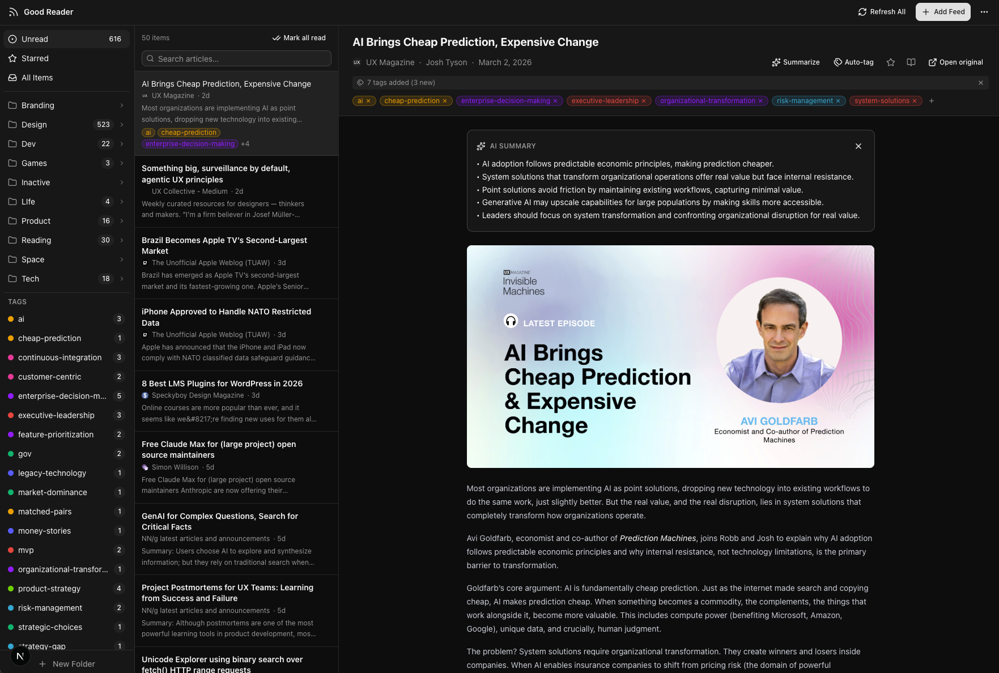

# Good Reader

A local-first RSS reader inspired by Google Reader. Built with Next.js, SQLite, and Tailwind CSS. Runs entirely on your machine — no accounts, no cloud, no tracking.



---

## About this project

I built this because I missed Google Reader. Clean feeds, no algorithm, no ads — just the internet the way I used to learn from it.

I used [Claude Code](https://claude.ai/code) to build it, which means the tool I used to make this is the same thing I was trying to understand. That felt like the right way to learn.

If it brings back the feeling too, star the repo. It helps more people find it.

And if you really love it: [buy me a coffee](https://paypal.me/heavycreams). Hon, you didn't have to, but I appreciate it.

---

## Features

### Core Reading Experience
- **Three-panel layout** — folders/feeds sidebar, article list, reading pane
- **Unread & Starred views** — fixed items at the top of the sidebar; Unread is the default view
- **Article content** — full article body rendered in a clean typography layout
- **Open original** — open the source article in a new tab
- **Mark as read/unread** — automatic on open, or toggle manually
- **Star articles** — save favorites for later

### Feed Management
- **Add feeds** — paste any RSS/Atom URL
- **Feed auto-discovery** — paste a site URL and Good Reader finds the RSS feed automatically
- **Feed favicons** — icons fetched by parsing each site's `<link rel="icon">` tag, not just `/favicon.ico`
- **Folders** — organize feeds into collapsible folders (collapsed by default)
- **Refresh All** — fetch latest articles from all feeds at once; updates title, URL, and favicon on each refresh
- **OPML import/export** — migrate from Google Reader, Feedly, or any other RSS reader

### Article Discovery
- **Full-text search** — powered by SQLite FTS5; searches titles and article bodies
- **Load more** — pagination for feeds with large backlogs (50 articles per page)
- **Auto-scroll** — article list keeps the selected item in view during keyboard navigation

### Article Tagging
- **Tags** — create and manage tags across all articles
- **Tag filtering** — click any tag in the sidebar to filter articles by that tag
- **Inline tag manager** — add or remove tags directly from the reading pane header
- **Tag pills** — tags shown on article cards in the list view (up to 3, with overflow count)
- **Auto-color** — tags are automatically assigned colors from a preset palette

### AI Features (via LM Studio)
- **Summarize** — one-click bullet-point summaries using a local LLM
- **Auto-tag** — automatically generates and applies relevant tags to an article using a local LLM; reuses existing tags and creates new ones freely (3–6 tags per article)
- Both features are configurable: set the server URL and model name in Settings

### Keyboard Shortcuts
| Key | Action |
|-----|--------|
| `j` | Next article |
| `k` | Previous article |
| `Enter` | Open original in browser |
| `s` | Star / unstar |
| `m` | Toggle read/unread |
| `r` | Refresh all feeds |
| `?` | Show keyboard shortcut help |

All shortcuts are **customizable** in Settings.

### Settings
- Remap any keyboard shortcut from a curated list of alternatives
- Configure LM Studio server URL and model name
- Settings persist in `localStorage`

---

## Tech Stack

| Layer | Technology |
|-------|-----------|
| Framework | Next.js 16 (App Router) |
| Styling | Tailwind CSS v4 + shadcn/ui |
| Database | SQLite via better-sqlite3 |
| Full-text search | SQLite FTS5 virtual table |
| RSS parsing | rss-parser |
| HTML parsing | jsdom (OPML import, feed discovery) |
| AI | LM Studio (OpenAI-compatible local API) |
| Desktop | Electron (wraps Next.js server natively) |

---

## Getting Started

### Prerequisites
- Node.js 18+
- npm

### Install & Run

```bash
git clone <repo-url>
cd good-reader
npm install
npm run dev
```

Open [http://localhost:3000](http://localhost:3000).

The SQLite database is created automatically at `data/good-reader.db` on first run.

### Adding Feeds

1. Click **+ Add Feed** in the top bar
2. Paste a feed URL (e.g. `https://hnrss.org/frontpage`) or a site URL — Good Reader will auto-discover the RSS link
3. Optionally assign to a folder and click **Add Feed**

### Importing from Another Reader

1. Export an OPML file from your current reader
2. Click **···** → **Import OPML** in Good Reader
3. All feeds and folders are imported automatically

### Running as a Desktop App (Electron)

Good Reader can run as a native desktop app on macOS and Windows via Electron.

**Development (live reload):**
```bash
npm run electron:dev
```
This starts Next.js and Electron together. The app opens in a native window.

**Build a distributable:**
```bash
npm run electron:build:mac   # macOS → dist-electron/*.dmg
npm run electron:build:win   # Windows → dist-electron/*.exe
npm run electron:build       # current platform
```

> **Note:** The first build requires `next build` to run, which compiles the app. The resulting package includes a bundled Next.js server — no separate install needed on the target machine.
>
> On macOS you can build both Intel (`x64`) and Apple Silicon (`arm64`) DMGs from the same command. Cross-compiling a Windows `.exe` from macOS requires Wine or a Windows CI runner.

The database is stored in the OS user-data directory (`~/Library/Application Support/Good Reader/` on macOS, `%APPDATA%\Good Reader\` on Windows) so it persists across app updates.

### AI Features Setup

1. Download and open [LM Studio](https://lmstudio.ai/)
2. Load a model (e.g. `meta-llama-3.1-8b-instruct`)
3. Start the local server (default port: `1234`)
4. In Good Reader: **···** → **Settings** → **AI**
5. Set the model name to match what's shown in LM Studio → **Save**
6. Open any article and click **✨ Summarize** or **🏷 Auto-tag**

---

## Project Structure

```
app/
  layout.tsx              — root layout, dark mode, Toaster
  page.tsx                — main three-panel UI (all state)
  globals.css             — Tailwind v4 + typography plugin
  api/
    folders/              — GET/POST/PATCH/DELETE folders
    feeds/                — GET/POST/PATCH/DELETE feeds
      discover/           — GET: auto-discover RSS from a site URL
      refresh-all/        — POST: refresh all feeds + update metadata/favicons
      [id]/refresh/       — POST: refresh single feed + update metadata/favicons
    articles/             — GET (with FTS search, tag filter) / PATCH
      [id]/summarize/     — POST: summarize via LM Studio
      [id]/auto-tag/      — POST: generate & apply tags via LM Studio
      [id]/tags/          — POST: add tag to article
      [id]/tags/[tagId]/  — DELETE: remove tag from article
      mark-all-read/      — POST: bulk mark read
    tags/                 — GET: list tags, POST: create tag
      [id]/               — PATCH: rename, DELETE: remove tag
    opml/                 — GET: export, POST: import
components/
  sidebar.tsx             — feed/folder tree + tags section with context menus
  article-list.tsx        — scrollable article cards with tag pills
  reading-pane.tsx        — article content, inline tag manager, AI summary/auto-tag
  top-bar.tsx             — Refresh All, Add Feed, ··· menu
  add-feed-dialog.tsx     — add feed with auto-discovery
  settings-dialog.tsx     — keyboard shortcuts + LM Studio config
  keyboard-shortcuts.tsx  — shortcut reference dialog
lib/
  db.ts                   — SQLite singleton + schema migrations + FTS5 + tags tables
  feed-fetcher.ts         — rss-parser wrapper + async favicon resolution
  keybindings.ts          — keybinding types, defaults, localStorage
  lmstudio.ts             — LM Studio config types, localStorage
  utils.ts                — shadcn cn() helper
electron/
  main.js                 — Electron main process; spawns Next.js server + BrowserWindow
  preload.js              — renderer preload (context isolation)
scripts/
  backfill-favicons.mjs   — one-time script to populate favicon_url for existing feeds
```

---

## Changelog

### Completed
- [x] Three-panel Google Reader–style layout
- [x] SQLite database with auto-migration on startup
- [x] Add / remove feeds and folders
- [x] Refresh individual feeds and refresh all
- [x] OPML import and export
- [x] Full-text search (SQLite FTS5)
- [x] Feed URL auto-discovery from site homepages
- [x] Load more / infinite scroll pagination
- [x] Auto-scroll article list on j/k navigation
- [x] Open all article links in new tab
- [x] Unread and Starred fixed sidebar items
- [x] Reading pane scrolls to top on article change
- [x] Customizable keyboard shortcuts (Settings)
- [x] Folders collapsed by default
- [x] "Inactive" folder for stale feeds
- [x] AI summarization via LM Studio (local LLM)
- [x] Article tagging with tag-based sidebar filtering
- [x] Inline tag manager in the reading pane
- [x] Tag pills on article cards
- [x] Auto-tag articles with LLM (creates new tags freely)
- [x] Feed favicons via `<link rel="icon">` parsing (not just `/favicon.ico`)
- [x] Feed metadata (title, URL, favicon) updated on every refresh

### Backlog
- [ ] Dark / light mode toggle
- [ ] "Read later" queue
- [ ] Mobile-responsive layout
- [x] Electron wrapper — native desktop app for macOS and Windows
- [ ] PWA support for offline reading

---

## Development Notes

- All API routes require `export const dynamic = 'force-dynamic'` to prevent build-time SQLite errors
- Tailwind v4: use `w-[360px]` not `w-90` (only multiples of 4 up to `w-96` are valid)
- Flex scroll pattern: `flex-1 min-h-0 overflow-y-auto` + `overflow-hidden` on the parent container
- SQLite FTS5: use actual table name in `MATCH` query, not an alias
- Tags use `json_group_array` / `json_object` correlated subquery to avoid N+1 queries
- The database file at `data/good-reader.db` is gitignored

---

## License

MIT
